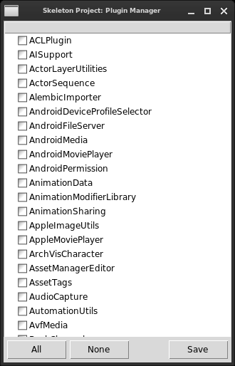
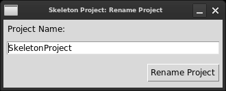

# Unreal Engine 5: Skeleton Project

A fine-tuned, lightweight, bare minimum, UE5 project to be used as the template for new projects.

## Features

* Disabled all superfluous plugins except CLion integration.

## Scripts

Find useful scripts in the `Scripts` directory.

These scripts require `tkinter` which ships with Python, and the `ttkwidgets` package.

### Scripts Prerequisites

Install dependencies globally:

```sh
pip install ttkwidgets
```

Or, create a virtual environment:

```sh
pip venv create Scripts/venv
source Scripts/venv/bin/activate
pip install ttkwidgets
```

### Running a Script

If you created a virtual environment for Python, be sure to activate it first:

```sh
source Scripts/venv/bin/activate
```

Then run the command listed in the script's section below.

## Plugin Manager

As a convenience over the built-in Plugin Browser, run the following to re-enable desired plugins in bulk.



```sh
python Scripts/PluginManager.py
```

## Rename Project

Also as a convenience, run the following to rename the project.

```sh
python Scripts/RenameProject.py
```



## ... But Why?

Project loads in under 2 seconds on my machine. Iterative development at its finest.

Fewer dependencies also leads to fewer headaches when upgrading to newer engine versions.
